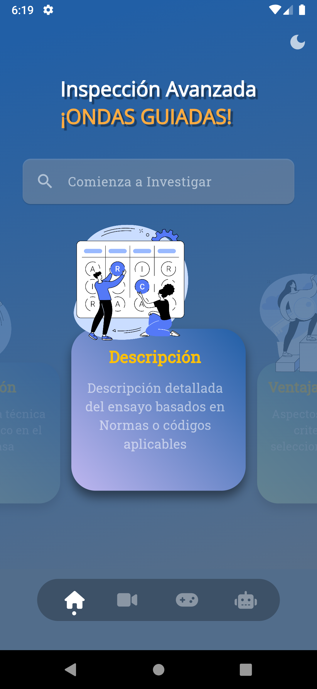

# Ondas Guiadas Aplicación Móvil

## Contenido Multimedia Mejorado:
Ofrece un extenso conjunto de materiales multimedia mejorados que abarcan textos, imágenes y gráficos interactivos para una comprensión profunda de las ondas guiadas.

## Diversos Temas

## Videos Instructivos:
Incluye videos que proporcionan una comprensión visual de los conceptos relacionados con las ondas guiadas, siendo herramientas clave para quienes prefieren aprender a través de la observación y la práctica.

## Entretenimiento Educativo:
Va más allá de la educación convencional con un juego interactivo diseñado para poner a prueba y consolidar los conocimientos adquiridos, haciendo el aprendizaje más atractivo y efectivo.

## Modelo de inteligencia Artificial:
La App cuenta con WaveChat, un chatbot que proporciona asistencia instantánea a los usuarios, respondiendo preguntas y resolviendo dudas al instante para un apoyo constante en la comprensión de las ondas guiadas.
